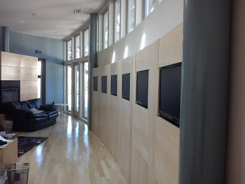
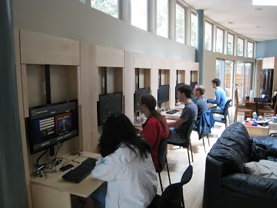
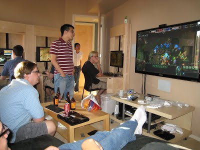
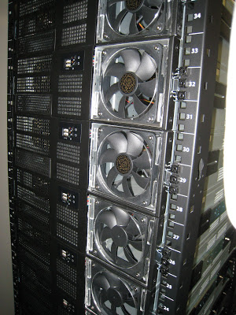
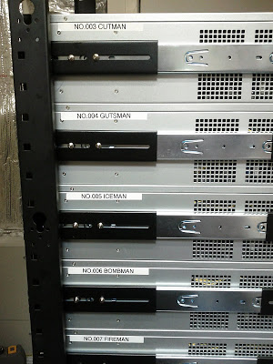

# Kenton's LAN Party House Management Script

<!-- TOC -->

- [Introduction](#introduction)
- [The Magic Sauce](#the-magic-sauce)
- [How to do it yourself](#how-to-do-it-yourself)
- [Background: My House](#background-my-house)

<!-- /TOC -->

## Introduction

My house ([see below](#background-my-house)) features twelve identical machines used for LAN parties. This repository contains the script I use to manage them, and a guide to creating a similar setup. I use this for gaming, but the setup could be just as useful for office machines, internet cafes, school computer labs, and the like.

## The Magic Sauce

Normally, maintaining twelve machines used by random guests would have two huge problems:

* Every machine would need to be updated before each party. With games regularly pushing multi-GB updates these days, this would take forever.
* Guests could easily mess up a machine at a party, requiring me to wipe it and start over, taking even more time.

But, I have solved these problems!

* I only install updates once, and they become immediately available to all machines -- no need even to "clone" the disk image.
* Any changes made by guests at a party are trivially wiped at the end of the party.

How?

* All game machines netboot over iSCSI, from a single server that manages all storage. The game machines don't even use their own disks at all.
* The server maintains a single master image, along with a copy-on-write overlay for each game machine. Any writes originating from one machine are written only to its private overlay. Any reads check the overlay first, and if the data hasn't been modified, read directly from the master image.
* When installing updates, I still use an overlay, but I then merge the overlay back into the master image once updates are complete.

Results:

* Since the overlays start empty, they can be created instantaneously at the start of the party. There is no need to copy the complete contents of the disk for each machine (which would take forever!).
* At the end of a party, the overlays are simply deleted, wiping out any changes any guest may have made. This, again, takes no time.
* Each overlay need only be big enough to store the *changes* made during a party, which are typically minimal. 20GB per overlay is plenty, even if the master image is terabytes in size.

## How to do it yourself

This repository contains the script I use to manage the computers, as well as a guide to help you replicate my setup. This repo will help you:

* Create a master volume and space for overlays using LVM.
* Configure DHCP, tftp, iPXE, and iSCSI for netboot.
* Configure a private DNS server so your machines can name each other (optional).
* Set up and tear down overlays for parties, as well as arrange to install updates, using a convenient script.
* Install Windows 10 directly to an iSCSI device.

[To get started, see the guide »](guide.md)

## Background: My House

**ALERT: [The house is for sale!!!](https://lanpartyhouse.com/)** _What can I say... I had a baby. And I've mooved to Austin, to be closer to my team at work. After nine years in the house, it's time to pass it on to a new owner._

In 2011 I built a house in Palo Alto, California optimized for LAN parties. It has computer stations built into the walls.

They fold up and look nice when not in use:

And they fold out like this:

Another room has six more:

The actual game machines are on a rack in the back room, along with the server.

 

Cable tubes run from the server room to all the machines, allowing cabling to be upgraded as needed. Currently, I run very long HDMI and USB cables through these tubes.

The house is designed by master architect [Richard Varda, FAIA](https://vardaarchitecture.com/) (my father). The game station paneling and all techincal details were designed by me.

I wrote about the house way back in 2011:

* [Original reveal blog post](http://kentonsprojects.blogspot.com/2011/12/lan-party-optimized-house.html)
* [The back story](http://kentonsprojects.blogspot.com/2011/12/lan-party-house-back-story.html)
* [Technical design and FAQ](http://kentonsprojects.blogspot.com/2011/12/lan-party-house-technical-design-and.html)

The house was covered in the media at that time, based on my blog posts:

* [Hacker News](https://news.ycombinator.com/item?id=3342044)
* [Reddit](https://www.reddit.com/r/gaming/comments/na0vv/lanparty_optimized_house/)
* [The Mary Sue](https://www.themarysue.com/google-engineer-lan-party-house/) ← I like the writing here.
* [New Atlas](https://newatlas.com/google-engineer-builds-ultimate-lan-party-house/20833/)
* [Kotaku](https://kotaku.com/this-house-was-built-for-lan-parties-5867502)
* [Engadget](https://www.engadget.com/2011/12/15/google-employee-creates-the-ultimate-lan-party-house-lives-la-v/)
* [AOL](https://www.aol.com/2011/12/19/google-engineer-turns-home-into-gamers-fantasy-lan/)
